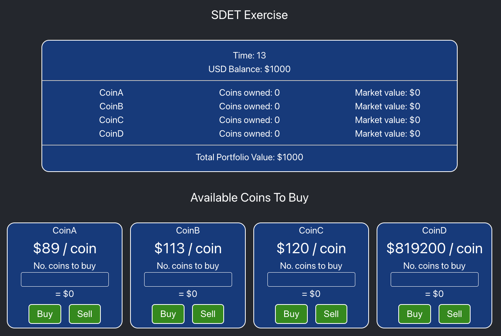

# SDET Exercise

This exercise is to help us better understand your experience in writing integration tests and additionally testing APIs.

## Install Dependencies and Start App

The exercise consists of two apps that run on your local machine, a frontend app (Vite) and a backend app (Express API Server). To complete the task you'll need to install the Node modules and start the front and back end apps using the following commands.

```
yarn install;
yarn start;
```

## Your Task

We would like you to test both the frontend and backend apps with a few small tests. Below is a screen capture of what the frontend app looks like after it has been loaded. Please use Cypress to test the frontend, and use SuperWsTest to test the backend. Organisation and ledgibility are important so please use a structure you feel is clear and sensible.

### Running the Tests

```
# Cypress
# https://www.cypress.io
# ./cypress/e2e/front-end.cy.js

# To run the Cypress tests:
yarn cypress run

# SuperWsTest
# https://www.npmjs.com/package/superwstest
# ./superwstest/back-end.test.js

# To run the SuperWsTest tests:
yarn jest
```

### Acceptance Criteria

The Cypress tests should -

- on load of the front end
  - assert that you begin with a $1000 USD balance
  - assert that there are four coin options available
  - assert that CoinB is incrementing by one dollar over time
- after buying three coins
  - assert "Coins owned" has incremented by the quantity you provided
  - assert that the "Market value" correctly reflects the cost per coin
- after selling one coin
  - assert "Coins owned" has decremented by the quantity you provided

The SuperWsTest tests should -

- when testing the endpoints
  - test for a successful response payload from the `purchase-coin` endpoint after a buy order is placed
- when testing the websocket
  - test that each message received matches the expected message payload shape
  - test that CoinB incremements by one dollar with each message over a period of time
  - test that `inventory.<coinId>.amountOwned` correctly reflects your owned inventory following a `purchase-coin` execution

Additional Notes

- Please spend as much time as you feel necessary to complete the task and show off your skills.
- Add comments where necessary or to document any assumptions/considerations you may have.
- Code quality, organisation and legibility are our primary focus here - please use best practices, future-proofing concepts, page models, code re-use, etc.

## Screen Capture



